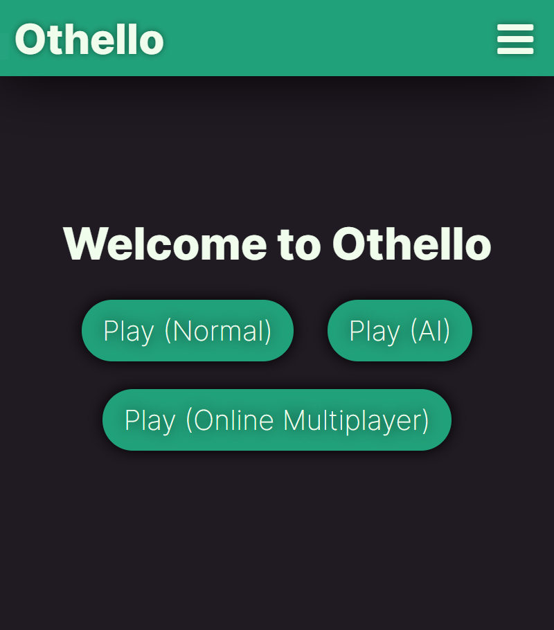
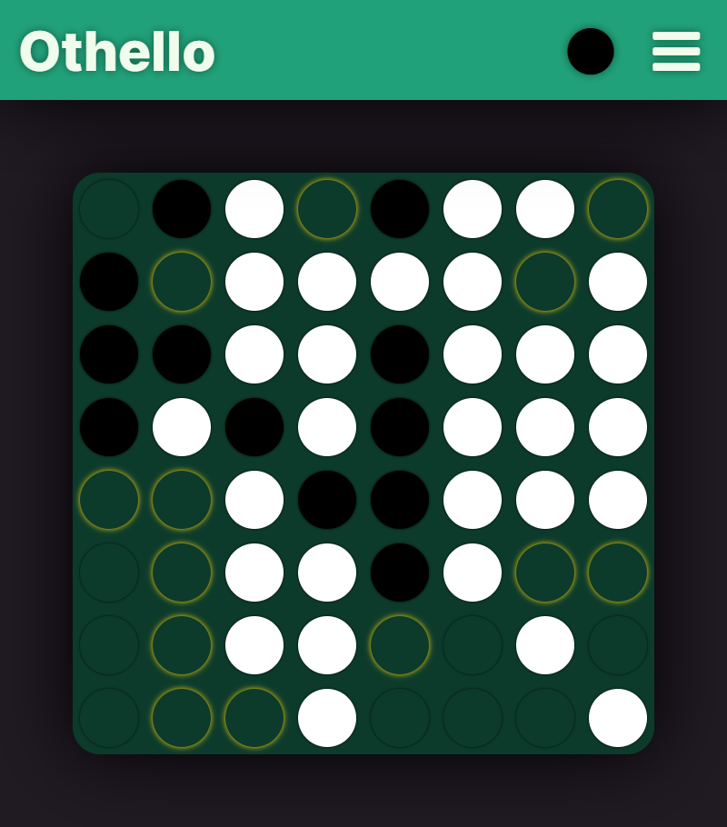
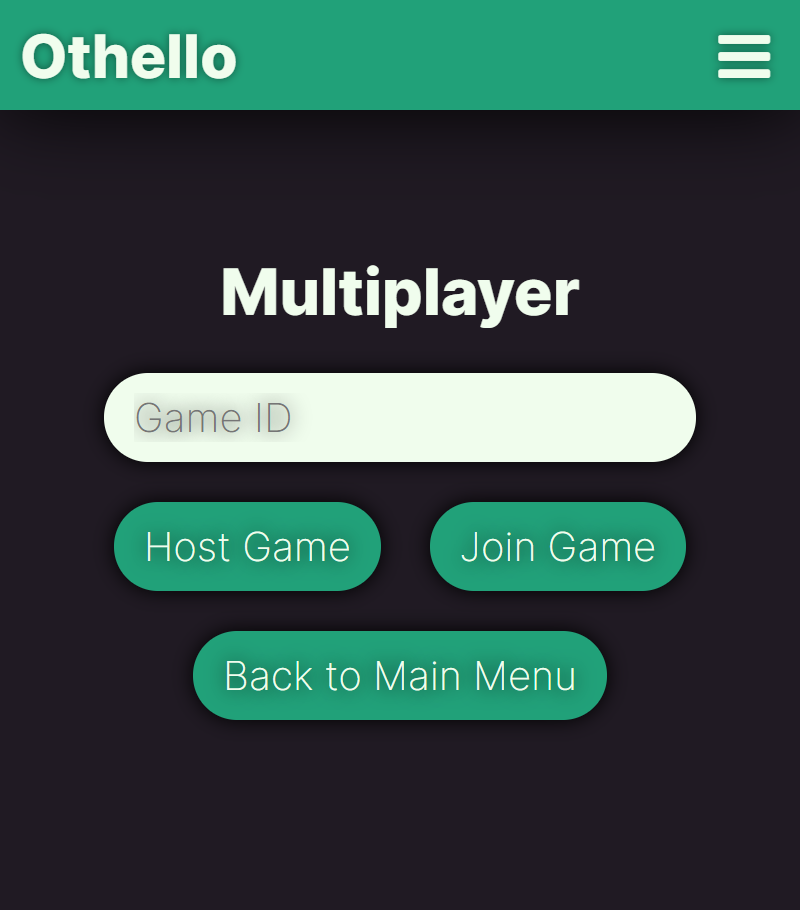

# Othello
This program is a simple yet beautiful Electron app to play the popular strategy game Othello. You can learn more about the game [here](https://en.wikipedia.org/wiki/Reversi#Othello).

## How do I install it?
There are three ways you can get this program.
- [Download the binary](https://github.com/w-henderson/Othello/releases) (recommended)
- [Play in a browser](https://w-henderson.github.io/Othello)
- Clone the repo, install dependencies, then run `npm start`. You can host the multiplayer server using `npm run serve`, but you'll need to change the `server` constant in `multiplayer.ts` to wherever you're hosting it.

# Features

## 🎲 Local Multiplayer
The simplest way to play Othello is using local multiplayer. You can play against another player on the same computer for a lag-free and social experience. Simply press "Play (Normal)" on the main menu to start a local multiplayer game. Black plays first, and the black or white circle in the top right of the screen indicates whose turn it is currently.

## 🤖 Play against a challenging AI
If you don't have anyone to play with, you can play against the computer itself by selecting "Play (AI)". The AI, while nowhere near unbeatable, is about as skilled as an average player so it's fun to warm up against. It uses a complex algorithm which involves evaluating its opponent's possible moves as well as valuing different locations on the board differently to decide which move is best. If you want more information about how the AI works, check out [the code](https://github.com/w-henderson/Othello/blob/master/www/ai.ts).

## 🌐 Online Multiplayer
If you want to play with a friend, but they don't have access to your physical computer, you can play online multiplayer! This uses the power of the internet to play against someone from anywhere in the world - in a game like this, ping isn't really an issue. Simply select "Play (Online Multiplayer)" from the main menu, and press "Host Game" to host a game. After a few seconds, the Heroku server will awaken and you'll see the board. At this point, you give the Game ID at the top of the screen to your opponent, who enters it into the box and presses "Join Game". Once they're in-game, you can play as normal!

**Note**: *This mode is still in development and could be buggy. If you come across any bugs, please open an issue!*

# Screenshots
| The main screen of the app | How it looks when in-game | The online multiplayer menu |
|:-------------------------:|:-------------------------:|:-------------------------:|
||||